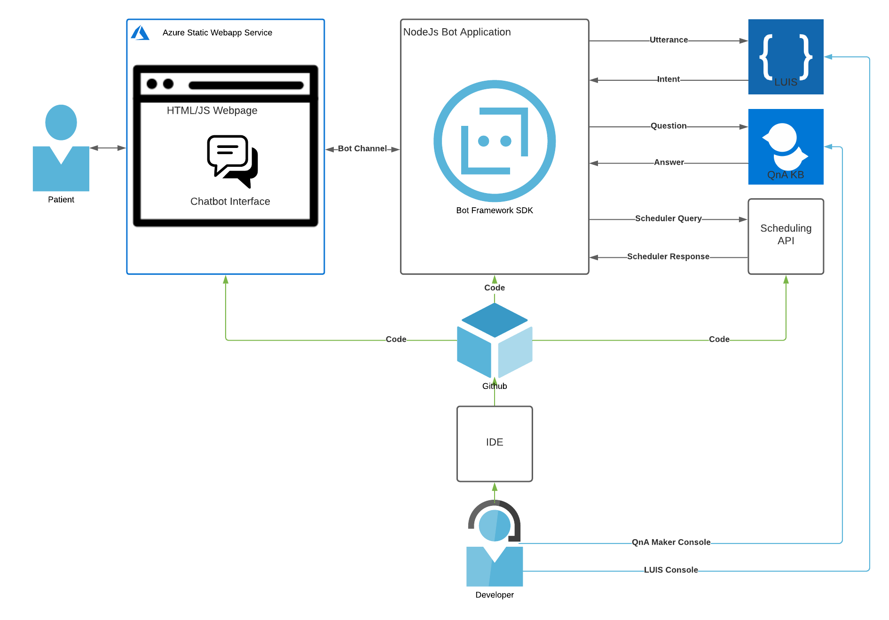

# Project Instructions to Student

For usage and instructions, [go back to README.md](README.md).

In this project, we will create a customer support chatbot that lives on a dentist website. The bot will use Azure QnA Maker and LUIS to answer patient questions and help them schedule appointments.

A diagram of the application architecture is below:

## Getting Started

**Set Up Your Project Environment**

1. Download and install [Visual Studio Code](https://code.visualstudio.com/download)
2. Download and install [NodeJS](https://nodejs.org/en/)
3. Download and install the [Bot Framework Emulator](https://github.com/Microsoft/BotFramework-Emulator/releases/tag/v4.13.0)
4. Fork the starter code repository to create your own GitHub repository for this project or use “git clone” to download the repository for local development.

**In this project, you'll need an Azure account to create resources on the Azure platform**

You have 2 options for using Azure to complete this project

**Option 1: Use the Udacity Azure Cloud Lab:**

Use the provided Azure Cloud Lab on the Right. This lab will provide you with Azure login credentials you can use for every Azure Portal (Azure Portal, LUIS Portal, and QnA Maker Portal) If you choose to use the Azure Cloud Lab, you will have 10 days, or 240 hours, to complete the project starting from the time you click the "Access Lab" button. After you click the "Access Lab" button, a timer will start. You cannot "pause" the timer or the lab. Once you reach the 240 hour limit on the timer, the Cloud Lab will stop and delete all of the resources you created in the Azure Portal or with this Azure account. Please ensure you complete the project within 10 days (240 hours) after you click the "Access Lab" button.

When you use the Cloud Lab, a resource group will be provided, please create all of your resources in this provided resource group. You will not be able to create more resource groups.

**Option 2: Use your own Azure Account:**

You can use your own Azure account to complete this project.

1. [Create a free Azure Account](https://azure.microsoft.com/en-us/free/) if you do not already have one.
2. Log into the [Azure Portal](https://portal.azure.com/) and create a new Resource Group for the project called DentistVirtualAssistant.

### Rubric

These are the rubric points used by the reviewers.

**Bot Development**

|                             Criteria                              |                                                                  Meets Specifications                                                                  |
|:-----------------------------------------------------------------:|:------------------------------------------------------------------------------------------------------------------------------------------------------:|
| Create a bot application that can be modified and tested locally  | The  student will demonstrate the ability to make modifications to the bot  code by using the bot emulator to show custom behavior with a  screenshot. |

**Training LUIS and QnA Maker**

|                  Criteria                   |                                                                                               Meets Specifications                                                                                               |
|:-------------------------------------------:|:----------------------------------------------------------------------------------------------------------------------------------------------------------------------------------------------------------------:|
| Train QnA Maker to answer common FAQs       | The  student will provide a screenshot of the bot responding appropriately  when asked an FAQ such as “I don’t have insurance. Can I still be seen?”                                                             |
| Train LUIS to recognize scheduling intents  | The  student will provide a screenshot of the bot running on the local  environment and web app answering the questions, “What appointments are  available?” showing answers of times available for appointment. |

**Deployment**

|                   Criteria                    |                                                                                                                                         Meets Specifications                                                                                                                                        |
|:---------------------------------------------:|:---------------------------------------------------------------------------------------------------------------------------------------------------------------------------------------------------------------------------------------------------------------------------------------------------:|
| Deploy bot code to Azure                      | The  student will show that they have successfully connected their local  environment to GitHub and GitHub to the app service by deploying custom  bot code to the live bot service. The student should provide a  screenshot of the bot functioning in the “test in webchat” interface in  Azure.  |
| Deploy the bot to a static web app in Azure.  | The  student will provide a URL to the static web app to the reviewers with a  functioning Dental Office Virtual Assistant and a dentistry theme.                                                                                                                                                   |
| Automate deployment through GitHub actions    | The student will provide the .yml files created by Azure from each .github/workflows folder.                                                                                                                                                                                                        |

### Step-by-step Instructions

**Create the Bot Application**

The Node.js bot application is the hub that connects all of our services into a single conversational interface. The starter code for this is in the ContosoDentistryChatBot folder in the project starter repository. It contains logic that determines how the conversation flows between patients and the ContosoDentristyWebsite Bot. Some of that logic is based on the feedback it gets from the connected services.

1. Create an Azure Bot resource in the Azure Portal
2. Create an App Service resource in the Azure Portal
3.Set the Azure Bot resource's messaging endpoint URL to the App Service's endpoint URL (don't forget to add /api/messages to the of the endpoint URL) in the Azure Bot configuration settings.
4. Create a Continuous deployment Reference ( Github CI / CD) in the Deployment Center of the App Service to the ContosoDentistryChatBot folder in your GitHub repo.
5. Add the Azure Bot Resource App ID and Password to the ContosoDentistryChatBot .env file
6. In the ContosoDentistryChatBot directory of your starter code, use the command npm install to install dependencies.
7. Use the command npm start to start ContosoDentistryChatBot
8. Use the Microsoft Bot Framework Emulator to test the bot and verify that it runs correctly.

**Create A QnA Maker Resource**

The QnA Maker Knowledge base will contain FAQs about the dentist office and allow our bot to answer them when the patient asks. QnA Maker uses NLP to interpret user utterances even if it has never seen the exact phrasing before.

1. Add a QnA Maker resource to the resource group.
1. Navigate to the QnA Maker portal.
1. Create a knowledge base.
1. Load dentist FAQs into the knowledge base from FAQ.tsv in the ContosoDentistryFAQs folder of the starter code repository.
1. Publish the knowledge base.
1. Copy the QnA maker keys to the ContosoDentistryChatBot .env file and the bot app service’s application settings.

**Create the LUIS Resource**

LUIS gives our bot application the ability to determine the intent of the patient’s utterances as well as extract entities such as the time a patient requests an appointment. LUIS will help our app handle requests related to our Dentist Scheduler App.

1. Add a language understanding resource to the resource group.
1. Navigate to the LUIS portal.
1. CreateGetAvailabilityand ScheduleAppointment intents.
1. Add example user input for both - labeling date-time entities where appropriate.
1. Train and publish the LUIS model.
1. Copy the LUIS keys to the bot’s env file and the bot app service’s application settings.

**Deploy the Dentist Scheduler App**

The Dentist Scheduler app represents a third-party API whose functionality can be integrated into our conversational interface.

1. Add a Web App resource to the resource group.
1. Create a Continuous deployment Reference ( Github CI / CD) in the Deployment Center for the Web App resource to the ContosoDentistryScheduler folder in the starter repository.
1. Copy the ContosoDentistrySchedulerAPI endpoint to the bot’s .env file and the bot app service’s application settings.

**Finish the Bot Code**

1. Fill in all of the necessary variables in the .env file of your starter code

In bot.js in the ContosoDentistryChatBot folder:

Follow the comments in the starter to do the following:

1. Create a QnAMaker connector
1. Create a DentistScheduler connector
1. Create a LUIS connector

In the OnMessage event handler function:

1. Get the results of the utterance from QnA Maker
1. Get the results of the utterance from LUIS
1. Write logic that uses the LUIS results to determine whether to make a request to the scheduling API or to return the results from QnA Maker

In the OnMembersAdded event handler function:

1. Write a custom greeting for the welcomeText that guides the user and tells them what the chatbot can do, and what they can say

Verify Your Bot Configuration

Once all of our services are up and running it is time to connect them all to our bot. Verify that the environment variables that have been collected in the previous steps are correct by testing the application locally and in Azure.

1. Test your changes locally.
1. Deploy your changes by pushing to GitHub.
1. Test in Web Chat in the Azure console.
1. Take a screenshot of the test in Web Chat and call it portal_bot_test(.jpg / .png)

Create The Dentist Website

The final step is to create a website for our dentist and deploy our bot to it.

1. Add a static web app resource to the resource group.
1. Create Continuous deployment Reference ( Github CI / CD) for the Static Web App resource to the ContosoDentistryWebsite folder in your starter repository (this contains the dentist website code).
1. Copy the generated HTML from the bot into the website - the Web Chat code from the bot channels interface in the bot service.
1. Paste the Web Chat code into the webpage.
1. Push to GitHub to deploy.
1. Take a screenshot of your working chatbot on your Dentist Website and call it website_bot_test(.jpg / .png)

**Standout Suggestions**

Consider adding some of these features to your project to make it stand out!

* Customize the bot to be able to answer questions beyond scheduling and insurance, such as the location and the staff.
* Customize the code for user navigational controls such as to forget appointment times, stop the conversation, and start it over.
* Create a high-quality business website with elements such as the location and hours of operation, social media icons, contact information, multiple images related to dentistry, and customer testimonials and reviews.